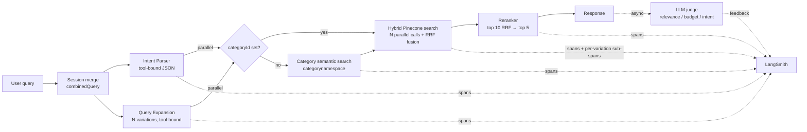

# rag-search-engine

A Java 17 / Spring Boot 3 reference implementation of a production-shaped RAG
search engine. The demo domain is an e-commerce product catalog, but the
pipeline — function-calling intent parser, multi-query expansion, two-namespace
vector store, RRF fusion, LLM reranker, async LLM-as-judge — is domain-agnostic.

The repository ships the full path: YAML catalog rules → expanded product
records → OpenAI descriptions → embeddings → Pinecone upsert → parallel intent
parse + query expansion → multi-query hybrid retrieval → reranking → response →
asynchronous evaluation posted to LangSmith.

A walkthrough of the entire request lifecycle, stage by stage, lives in
[`overview.md`](overview.md).

---

## What it does

A query like `"premium noise-cancelling headphones under $400 with free
shipping"` is parsed into a strictly-typed intent (tool-bound JSON, no
free-text parsing), simultaneously expanded by an LLM into N semantically
distinct retrieval queries, routed to a category, fanned out across N
parallel Pinecone calls, merged into a consensus pool via Reciprocal Rank
Fusion, reranked by an LLM, returned to the caller, and asynchronously scored
by a judge that posts feedback to the same LangSmith trace.

Every request emits per-stage OpenTelemetry spans (with token + cost
attributes), and sub-spans per variation under the hybrid search span so
you can read "variation 1 took 180ms, variation 3 was the tail at 410ms" off
a single trace.

The price-boundary eval cases (`variantOverrides` in
`curated-product-rules.yaml`) are deliberately constructed so removing the
Pinecone `price` metadata filter immediately fails the eval suite — the
suite exists to catch metadata-filter regressions before they ship.

> **Note on data.** Catalog rules use real brand and model names for
> readability. The data is illustrative only — prices, ratings, and variant
> attributes are crafted for adversarial eval coverage, not for accuracy.
> All trademarks belong to their respective owners.

---

## Architecture



Per-request OTel spans:
- `product.search.process` (root)
- `product.intent.parse` + `product.query.expansion` (siblings, parallel)
- `product.category.search` (only when category is resolved semantically)
- `product.hybrid.search` with N children `product.search.variation #i`
- `product.reranker`

All LLM spans carry GenAI semantic attributes (`gen_ai.request.model`,
input/output tokens) plus a derived `product.cost.usd`. The hybrid-search span
adds `search.query_variations`, `search.candidates_before_dedup`,
`search.candidates_after_dedup`, `search.fusion_method`, plus consensus
counters (`candidates_in_all_variations`, `candidates_in_majority`).

The full ingestion + query flow with per-stage detail is in
[`docs/system-flow.md`](docs/system-flow.md).

### Design notes

**Parallel intent parse + query expansion.** The two opening LLM calls both
read only `ctx.combinedQuery` and write to disjoint context fields, so the
orchestrator runs them concurrently via `CompletableFuture.allOf(...)`.
Wall-clock total is `max(intent, expansion)` instead of the sum. OTel root
span context propagates to worker threads via `ContextPropagatingTaskDecorator`
on the executor, so both stages' spans land as siblings of the root.

**Multi-query expansion with RRF.** The expansion stage produces N
semantically distinct rewrites of the user query — each a complete 1-2
sentence retrieval query, enforced via a tool-bound JSON schema with a
length-anchored item description. Each variation hits Pinecone in parallel.
Results are merged via Reciprocal Rank Fusion (k=60): a product at rank 5
in all 3 variations outscores a product at rank 1 in one. Consensus across
independent angles is the strongest relevance signal we have, and RRF is
the standard way to capture it without comparing absolute cosine scores
across queries.

**Per-stage model and temperature, one line in config.** Every LLM call
site reads its own model + temperature from `application.properties`:

```properties
openai.model.intent=gpt-4o-mini:0.0
openai.model.expansion=gpt-4o-mini:0.7
openai.model.reranker=gpt-4o-mini:0.0
openai.model.judge=gpt-4o-mini:0.0
openai.model.catalog=gpt-4o-mini:0.7
openai.model.embedding=text-embedding-3-small
```

Bumping `openai.model.intent=gpt-4:0.0` for one A/B run requires no code
change. Cost and quality of any one stage swap shows up directly in the
trace via the existing per-span cost attribution.

**Strict structured output everywhere LLMs return data.** Intent parse
and query expansion both run as tool-bound calls with `ToolChoice.REQUIRED`
and JSON schemas. The LLM cannot return free-text — it's forced to fill a
typed object the schema enforces at the API boundary. Parsing failures
surface as exceptions, not silent drift.

**Two namespaces, one index.** Categories live in `categorynamespace`,
products in `productsnamespace`. Different change velocities — category
vocabulary is stable; product price, stock, and SKU set churn. Splitting
them lets each be reindexed independently and avoids re-embedding stable
text on every product update.

**Hybrid retrieval over pure vector or pure SQL.** Product search passes
both a vector and a metadata filter to Pinecone in a single call.
Metadata handles hard constraints (price range, brand, category,
shipping/warranty flags); vectors handle the semantic layer (use case,
quality cues, fit). Pure vector does not understand `< $400`; pure SQL
does not understand `"for daily commuting"`.

**Brand and category lists are dynamic against the catalog.** The intent
parser's schema lists valid `categoryId` and `brandCode` values pulled at
request time from `CatalogMetadataProvider`, which reads `products.json`.
Re-generate the catalog and the parser sees the new brands on the next
request without a code change.

**LLM-as-judge runs async on every search.** A dedicated thread pool
evaluates each completed search against `relevance`, `budget_adherence`,
and `intent_accuracy` and posts scores to the LangSmith Feedback API
attached to the original request's trace. The judge never blocks the
user response.

**Reranker as its own span.** RRF returns the consensus-ordered candidate
pool; the reranker caps input at 10 (`ProductRerankerService.MAX_CANDIDATES_TO_RANK`)
and emits the top 5. Keeping it a separate span makes the cost/latency
contribution measurable and gives the reranker the *original* user query,
not the variations — recall is RRF's job, precision is the reranker's.

---

## Tech stack

| Layer | Choice |
|---|---|
| Language | Java 17 |
| Framework | Spring Boot 3.4 |
| Build | Maven |
| LLM client | LangChain4j 1.0 + OpenAI (`gpt-4o-mini` default; per-stage configurable) |
| Vector store | Pinecone (official `io.pinecone:pinecone-client` 4.0 SDK) |
| Embeddings | OpenAI `text-embedding-3-small` |
| Tracing | OpenTelemetry SDK + OTLP exporter → LangSmith |
| Eval | JUnit 5 + AssertJ |
| Other | OkHttp (LangSmith feedback API only), Jackson (JSON + YAML), Lombok, Apache Commons Lang |

---

## Running locally

### Prerequisites

- Java 17 (`java --version`)
- Maven 3.9+
- An OpenAI API key
- A Pinecone account with an index that has two namespaces:
  `categorynamespace` and `productsnamespace`
- (Optional) A LangSmith project for tracing + judge feedback

### Configure environment

```bash
cp env.properties.example env.properties
# Edit env.properties — see "Environment variables" below
```

`env.properties` is gitignored. Both Surefire (tests) and a Spring Boot
`EnvironmentPostProcessor` (runtime) load it; no `-D` flags are required.

### Three-step ingestion

The pipeline expects three POSTs in order. The first is read-after-write:
the same JVM session can run all three back-to-back.

```bash
mvn spring-boot:run
```

In a second terminal:

```bash
# 1. Expand curated-product-rules.yaml → products.json
#    + generate per-variant GPT descriptions (parallel).
#    Idempotent: existing productIds in products.json are reused, only
#    missing records call OpenAI. Run again to fill gaps after a crash.
curl -X POST http://localhost:8080/api/v1/ingestion/generate-catalog

# 2. Embed categories from category.json into Pinecone categorynamespace.
curl -X POST http://localhost:8080/api/v1/ingestion/categories

# 3. Embed every product record into Pinecone productsnamespace (parallel).
curl -X POST http://localhost:8080/api/v1/ingestion/products
```

### Query the engine

```bash
curl -X POST http://localhost:8080/api/v1/product-search/chat \
  -H 'Content-Type: application/json' \
  -d '{
    "message": "premium noise-cancelling headphones under $400 with free shipping",
    "conversationId": "test-1"
  }'
```

A minimal browser UI is served at `http://localhost:8080/` — three-column
layout showing the per-stage pipeline trace and the final ranked products.

### Run the eval suites

```bash
# 8 deterministic cases asserting on business outcomes
mvn test -Dtest=ProductSearchEvalTest

# RAGAS-inspired metrics: faithfulness, answer relevancy, context precision
mvn test -Dtest=ProductRagasEvalTest
```

Both suites hit the live OpenAI + Pinecone stack. If `env.properties` is
absent or incomplete, they skip cleanly via `@EnabledIf` and the build
still passes.

---

## Configuration

All knobs live in `src/main/resources/application.properties`. Defaults
shown; every value is env-overridable (Spring Boot relaxed binding —
`SEARCH_QUERY_VARIATIONS`, `OPENAI_MODEL_INTENT`, etc.).

| Property | Default | Purpose |
|---|---|---|
| `search.query_variations` | `3` | Number of expansion variations. `1` disables the expansion LLM call entirely and runs a single dense retrieval (baseline-for-comparison path). |
| `pinecone.index.name` | `at-ai-lab-index-openai-3-small` | Pinecone index name |
| `openai.model.intent` | `gpt-4o-mini:0.0` | Model + temperature for intent parsing |
| `openai.model.expansion` | `gpt-4o-mini:0.7` | Model + temperature for query expansion (creativity matters here) |
| `openai.model.reranker` | `gpt-4o-mini:0.0` | Model + temperature for LLM rerank |
| `openai.model.judge` | `gpt-4o-mini:0.0` | Model + temperature for async judge |
| `openai.model.catalog` | `gpt-4o-mini:0.7` | Model + temperature for catalog description generation |
| `openai.model.embedding` | `text-embedding-3-small` | Embedding model (no temperature) |
| `server.port` | `8080` | HTTP port |

Secrets live in `env.properties` (gitignored, never committed):

| Variable | Purpose |
|---|---|
| `OPENAI_API_KEY` | All OpenAI calls |
| `PINECONE_API_KEY` | Vector store |
| `LANGSMITH_API_KEY` | Trace export + judge feedback posting |
| `LANGSMITH_ENDPOINT` | LangSmith base URL (e.g. `https://api.smith.langchain.com`) |
| `LANGSMITH_PROJECT` | Project name |
| `LANGSMITH_SESSION_ID` | Project UUID (from the LangSmith project URL after `/p/`) — required to map OTel `trace_id` → LangSmith `run_id` when posting judge feedback |

LangSmith variables can be omitted for local development; tracing simply
posts nothing and the judge logs the score instead of submitting feedback.

---

## REST endpoints

| Method | Path | Purpose |
|---|---|---|
| POST | `/api/v1/ingestion/generate-catalog` | YAML → `products.json` + GPT descriptions |
| POST | `/api/v1/ingestion/categories` | Embed categories into Pinecone |
| POST | `/api/v1/ingestion/products` | Embed products into Pinecone |
| POST | `/api/v1/product-search/chat` | Run a search through the full pipeline |
| GET  | `/api/v1/product-search/health` | Liveness probe |

---

## Repository layout

```
src/main/java/com/productsearch/
  controller/        REST endpoints (search + ingestion)
  pipeline/          The orchestrator + stages + shared SearchContext
                       SearchPipeline.java       orchestrator, parallel fanout, agent hook placeholders
                       SearchContext.java        shared mutable per-request state
                       IntentParseStage.java     tool-bound intent parse + session accumulator
                       QueryExpansionStage.java  tool-bound multi-query rewrite
                       CategoryRouteStage.java   direct or semantic category resolution
                       HybridSearchStage.java    N parallel Pinecone calls + RRF fusion
                       RerankStage.java          LLM rerank top10 → top5
                       RespondStage.java         response text + async judge dispatch
  service/           Stateless services consumed by stages
  infra/             PineconeIndex (SDK facade), SecretManagerService,
                     CatalogMetadataProvider, SessionManager, LLMCallResult
  tracing/           ProductPipelineTracer (OTel + cost attribution)
  evaluation/        ProductJudgeService + LangSmith feedback poster
  config/            OpenAiClientsConfig (per-stage models),
                     AsyncConfig (executors + ContextPropagatingTaskDecorator),
                     OpenTelemetryConfig

src/main/resources/
  application.properties      All tunable knobs (models, temps, variation count)
  curated-product-rules.yaml  Catalog rules (categories, brands, products, eval boundaries)
  category.json               Category descriptions for category embedding
  products.json               Generated per-variant records (idempotent)
  static/index.html           Browser UI

src/test/java/com/productsearch/eval/
  ProductSearchEvalTest        Deterministic outcome assertions
  ProductRagasEvalTest         Aggregate metric thresholds

overview.md                    End-to-end request lifecycle walkthrough
docs/system-flow.md            Ingestion + query flow with diagrams
```

---

## Production gaps

The intent of this repo is to be a working reference, not a deployable
service. Things you would change for production scale:

- **Agent layer.** The orchestrator has three explicit `[AGENT HOOK N]`
  placeholders for confidence-based clarification, semantic-retry on
  weak category match, and filter-relaxation on low recall. They're
  comments today; the next phase fills them in.
- **Streaming ingestion.** Replace the three-endpoint batch flow with CDC
  from the OLTP source-of-truth so out-of-stock SKUs evict within minutes.
- **Per-tenant namespaces.** Two namespaces are fine for one catalog; a
  marketplace needs per-merchant isolation for data and cost attribution.
- **Cost guardrails.** Per-user spend caps with a kill-switch to cached
  or rules-based results when budgets are exceeded.
- **Graceful LLM-unavailable fallback.** Intent-parser failure currently
  surfaces as an error. Production should degrade to keyword extraction
  over the raw query and return a `best-effort` flag.
- **Learned reranker.** Once there is click-through and purchase
  telemetry, replace the LLM reranker with a trained model
  (LambdaMART / lightweight neural ranker) for sub-millisecond serving.

---

## License

Apache 2.0. See `LICENSE` if present.
